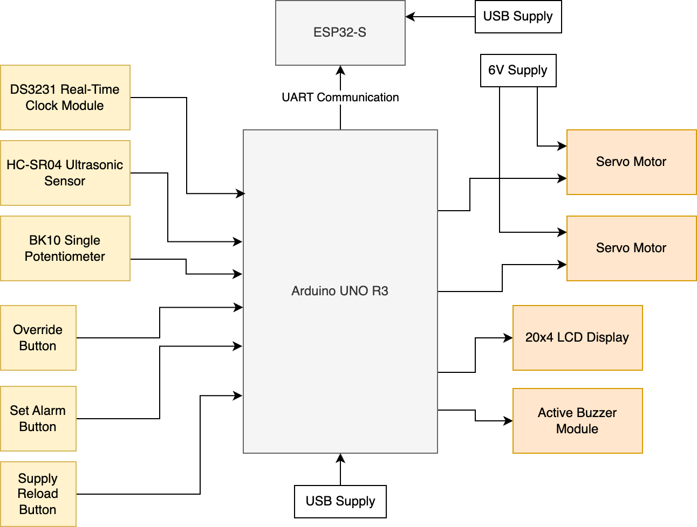
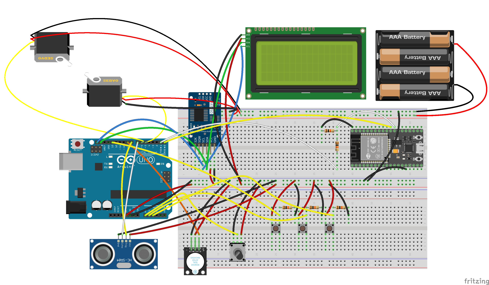
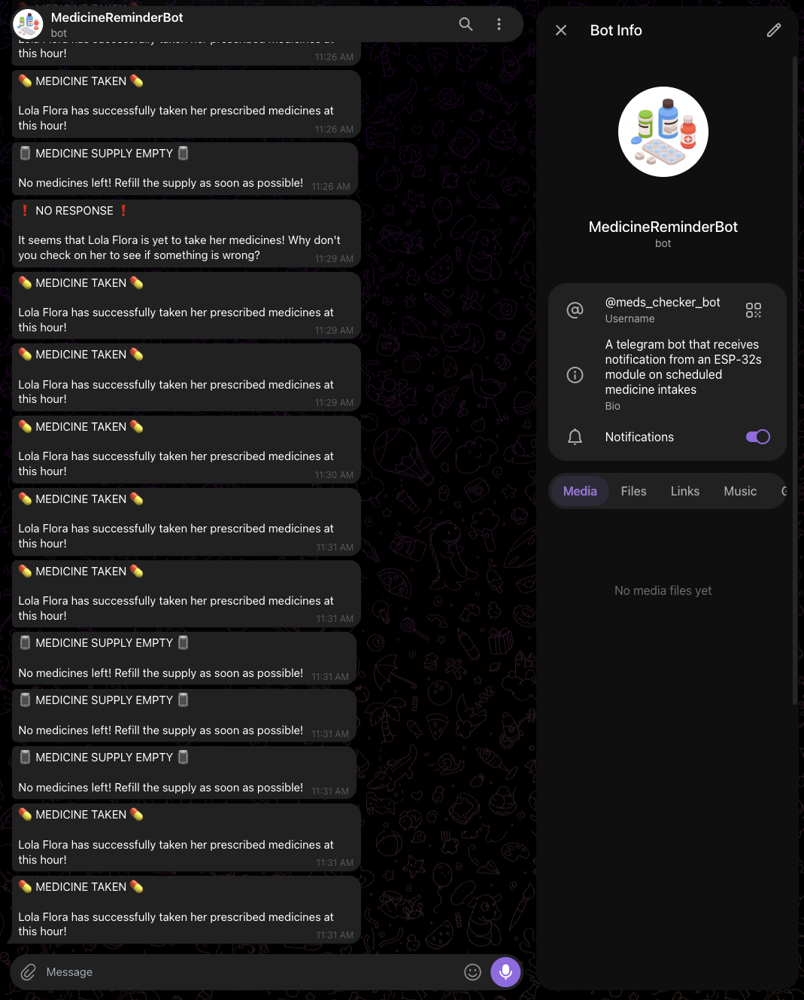

# Arduino & ESP32 Medicine Intake Scheduler and Pill Bottle Dispenser

An Arduino and ESP32-based embedded system that schedules medication intake, automatically dispenses pill bottles, and sends real-time Telegram notifications to a caregiver.


## Overview

Medication adherence can be difficult, especially for elderly patients who take multiple medicines throughout the day. Missing or delaying medication may have serious health consequences, while caregivers cannot always be physically present to monitor every dose.

This project was developed as part of an undergraduate **Embedded Systems** course and demonstrates how low-cost embedded hardware can be combined with Internet connectivity to create a smart medication reminder and dispensing system.

The system allows users to configure up to **three daily medication schedules**, automatically reminds the user at the correct time, dispenses a pill bottle upon hand detection, and notifies a caregiver through Telegram regarding medication intake, missed doses, and depleted medicine supply.

Although this repository is archived and no longer under active development, it is preserved as a reference implementation for similar Arduino and ESP32 projects.


## Features

- Configurable medication schedule (three daily alarms)
- Real-Time Clock (RTC)-based scheduling
- LCD user interface
- Push-button and potentiometer controls
- Audible medication reminder via buzzer
- Automatic bottle dispensing using servo motors
- Ultrasonic hand detection
- Telegram notifications through ESP32
- Missed medication detection
- Empty medicine supply notification
- Manual medicine supply refill


## System Workflow

1. Configure medication schedules using the push buttons and potentiometer.
2. Compare the current RTC time against the configured schedules.
3. Activate the buzzer and display a reminder on the LCD.
4. Detect the user's hand using the ultrasonic sensor.
5. Dispense a medicine bottle using the servo mechanism.
6. Notify the caregiver via Telegram that the medicine was taken.
7. If no interaction occurs, send a "No Response" notification.
8. Notify the caregiver when the medicine supply becomes empty.
9. Reload the dispenser using the refill button.


## Hardware

| Component | Purpose |
|------------|---------|
| Arduino Uno R3 | Main controller |
| ESP32 | Wi-Fi and Telegram connectivity |
| DS3231 RTC | Timekeeping |
| 16×2 I²C LCD | User interface |
| HC-SR04 Ultrasonic Sensor | Hand detection |
| SG90 Servo Motors (×2) | Bottle dispensing |
| Active Buzzer | Audible reminder |
| Push Buttons | Navigation and confirmation |
| Potentiometer | Time and menu selection |


## Software

These libraries are available via the Arduino IDE in-application library manager.

- Arduino IDE
- RTClib
- LiquidCrystal_I2C
- Servo
- WiFi
- WiFiClientSecure
- UniversalTelegramBot
- ArduinoJson


## Gallery

<table align="center">
  <tr>
    <th align="center">Block Diagram</th>
    <th align="center">Breadboard Wiring Diagram</th>
  </tr>
  <tr>
    <td align="center">
      
    </td>
    <td align="center">
      
    </td>
  </tr>
  <tr>
    <th align="center">Prototype</th>
    <th align="center">Telegram Notifications</th>
  </tr>
  <tr>
    <td align="center">
      
    </td>
    <td align="center">
      
    </td>
  </tr>
</table>


## Repository Structure

```text
Arduino/
    Arduino Uno firmware

ESP32/
    ESP32 firmware

images/
    Photos and screenshots

README.md
LICENSE
```


## Building the Project

### Arduino Uno

1. Open the Arduino firmware in Arduino IDE.
2. Install the required libraries.
3. Upload the sketch to the Arduino Uno.

### ESP32

Before uploading, replace the following placeholders with your own credentials:

```cpp
const char* ssid = "YOUR_WIFI_SSID";
const char* password = "YOUR_WIFI_PASSWORD";

#define BOTtoken "YOUR_TELEGRAM_BOT_TOKEN"
#define CHAT_ID "YOUR_TELEGRAM_CHAT_ID"
```

Then upload the sketch to the ESP32.


## Future Improvements

Some ideas that were beyond the scope of the project include:

- Mobile application integration
- Cloud-based medication logging
- Battery backup
- Individual pill dispensing instead of bottle dispensing
- Automatic schedule synchronization
- Multiple user profiles


## Project Status

> [!IMPORTANT]
> This repository is archived and is no longer actively maintained.
>
> It is preserved as the final version of our Embedded Systems course project and may serve as a learning resource for similar Arduino and ESP32 projects.

---

## License

This project is released under the MIT License.

See the `LICENSE` file for details.